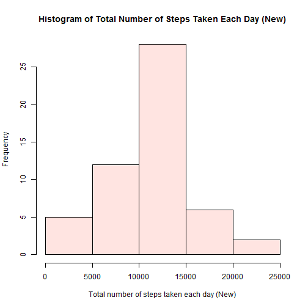

output:     
          html_document:    
            keep_md: true

Reproducible Research: Peer Assessment 1
========================================

## Loading and preprocessing the data


```r
unzip("activity.zip")
data <- read.csv("activity.csv", header = TRUE)
```

## What is mean total number of steps taken per day?

1. Make a histogram of the total number of steps taken each day.


```r
steps_per_day <- aggregate(steps ~ date, data, sum)
hist(steps_per_day$steps, main = "Histogram of Total Number of Steps Taken Each Day", xlab = "Total number of steps taken each day", col = "light blue")
```

 

2. Calculate and report the **mean** and **median** total number of steps taken per day.


```r
mean(steps_per_day$steps)
```

```
## [1] 10766.19
```

```r
median(steps_per_day$steps)
```

```
## [1] 10765
```

## What is the average daily activity pattern?

1. Make a time series plot (i.e. type = "l") of the 5-minute interval (x-axis) and the average number of steps taken, averaged across all days (y-axis).


```r
steps_interval <- aggregate(steps ~ interval, data, mean)
plot(steps_interval, type="l", main = "Average Number of Steps Per 5-min Interval", xlab = "Interval", ylab = "Average number of steps per interval")
```

 

2. Which 5-minute interval, on average across all the days in the dataset, contains the maximum number of steps?


```r
steps_interval$interval[which.max(steps_interval$steps)]
```

```
## [1] 835
```

## Imputing missing values

1. Calculate and report the total number of missing values in the dataset (i.e. the total number of rows with NAs)


```r
sum(is.na(data))
```

```
## [1] 2304
```

2. Devise a strategy for filling in all of the missing values in the dataset. The strategy does not need to be sophisticated. For example, you could use the mean/median for that day, or the mean for that 5-minute interval, etc.

I will use the mean for the 5-minute intervals for filling in all missing values.

3. Create a new dataset that is equal to the original dataset but with the missing data filled in.


```r
data_new <- merge(data, steps_interval, by = "interval", all.y = F)
nas <- is.na(data$steps)
data_new$steps[nas] <- data_new$steps.y[nas]
data_new <- data[, c(1:3)]
```

4. Make a histogram of the total number of steps taken each day and Calculate and report the **mean** and **median** total number of steps taken per day. Do these values differ from the estimates from the first part of the assignment? What is the impact of imputing missing data on the estimates of the total daily number of steps?

Make a histogram of the total number of steps taken each day

```r
steps_per_day_new <- aggregate(steps ~ date, data, sum)
hist(steps_per_day_new$steps, main = "Histogram of Total Number of Steps Taken Each Day (New)", xlab = "Total number of steps taken each day (New)", col = "mistyrose")
```

 

Calculate and report the **mean** and **median** total number of steps taken per day.


```r
mean(steps_per_day_new$steps)
```

```
## [1] 10766.19
```

```r
median(steps_per_day_new$steps)
```

```
## [1] 10765
```

Do these values differ from the estimates from the first part of the assignment? What is the impact of imputing missing data on the estimates of the total daily number of steps?

Mean (with missing values)       = 10766.19  
Mean (without missing values)    = 10766.19  
Median (with missing values)     = 10765  
Median (without missing values)  = 10766.19

As seen from above, the mean of total number of steps per day does not differ from the estimate from the first part. Although a marginal difference was observed for the median.
When estimating the total number of steps per day, the impact of the missing data seems minimal.

## Are there differences in activity patterns between weekdays and weekends?

1. Create a new factor variable in the dataset with two levels - "weekday" and "weekend" indicating whether a given date is a weekday or weekend day.


```r
day_type <- function(date) {
    if (weekdays(as.Date(date)) %in% c("Saturday", "Sunday")) {
        "weekend"
    } else {
        "weekday"
    }
}
data_new$day_type <- as.factor(sapply(data_new$date, day_type))
```

2. Make a panel plot containing a time series plot (i.e. type = "l") of the 5-minute interval (x-axis) and the average number of steps taken, averaged across all weekday days or weekend days (y-axis). See the README file in the GitHub repository to see an example of what this plot should look like using simulated data.


```r
library(ggplot2)
ave_steps <- aggregate(steps ~ interval + day_type, data_new, mean)
ggplot(ave_steps, aes(x=interval, y=steps)) + geom_line() + facet_wrap(~ day_type, nrow = 2)
```

 
